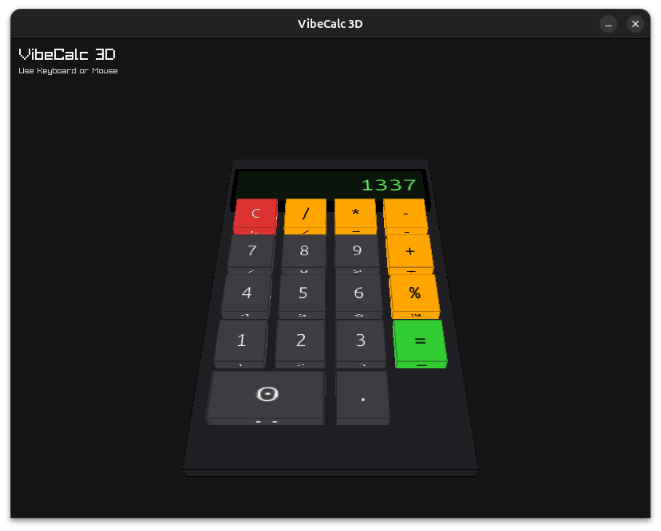

# VibeCalc 3D

**VibeCalc 3D** is a stylish, retro-futuristic calculator application built in C using the **Raylib** game programming library. It features a fully interactive 3D interface with physically animated buttons, a sleek chassis design, and a digital-style display.



## Features

*   **Immersive 3D Design**: A complete 3D model with a chassis, inset screen, and textured buttons.
*   **Interactive Controls**:
    *   **Mouse**: Click buttons directly in the 3D view.
    *   **Keyboard**: Full support for Numpad, Number row, Enter, Backspace, etc.
*   **Animations**: Smooth launch and exit sequences, plus tactile button-press animations.
*   **Standard Operations**: Supports Addition, Subtraction, Multiplication, Division, and Modulus.
*   **Error Handling**: Gracefully handles errors like division by zero.

## Build & Run

### Prerequisites
*   **Linux** (Tested on Ubuntu 24.04)
*   **GCC** or compatible C compiler
*   **Raylib** (Version 5.0+, installed via package manager or source)

### Installation
1.  Navigate to the project directory:
    ```bash
    cd vibecalc
    ```
2.  Compile the application:
    ```bash
    make
    ```
3.  Run the calculator:
    ```bash
    ./vibecalc
    ```
4.  Clean up build files:
    ```bash
    make clean
    ```

## Controls

| Key | Action |
| :--- | :--- |
| **0-9** | Input Numbers |
| **+ - * /** | Arithmetic Operators |
| **%** | Modulus |
| **Enter / =** | Calculate Result |
| **Backspace / Del** | Clear (C) |
| **Esc** | Close Application |

## Tech Stack
*   **Language**: C
*   **Graphics**: Raylib
*   **Font**: Ubuntu Mono

Enjoy your 3D calculation experience!
